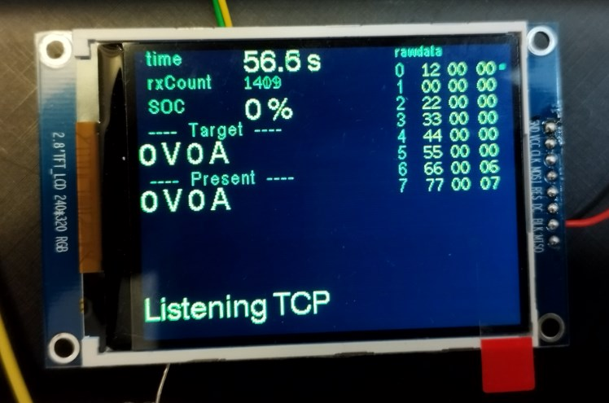
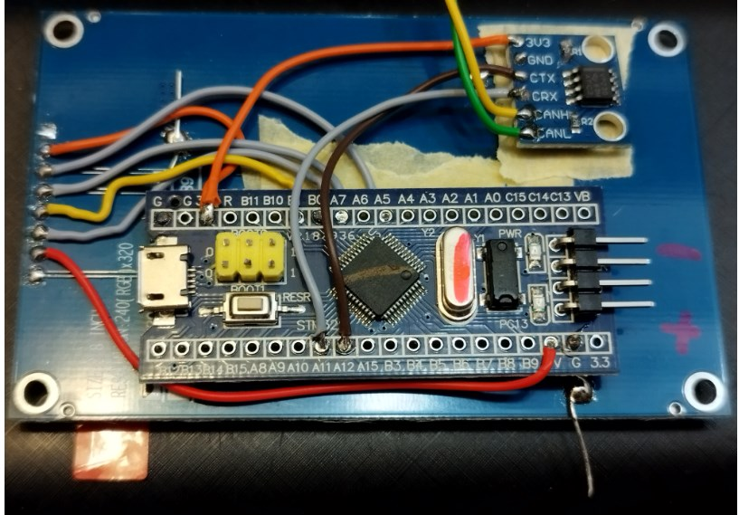

# TFT with CAN

STM32F1 "BluePill" receives data from CAN and shows it on a TFT display with ILI9341 via SPI




## Wiring

* All GND together
* 5V  DISPLAY_BLK (backlight)
* 3.3V DISPLAY_VCC (supply for the display controller)
* A5  DISPLAY_CLK
* A7  DISPLAY_MOSI
* B0  DISPLAY_DC
* B1  DISPLAY_RES
* 3.3V CAN_3V3
* A12 CAN_TX
* A11 CAN_RX


The display works without CS and without MISO.

## Pitfalls

### Pitfall 1: Faked bluepill boards

There are some fake bluepill boards around. The STM32 CubeIDE just says "Error in initializing ST-LINK device. Reason: ST-LINK: Could not verify ST device! Abort connection."

Workaround: let the STM32 CubeIDE create a hex file, and flash this using the command line utility ST-LINK_CLI.

For creating the hex file, in CubeIDE right-click on the project -> properties -> C/C++Build -> Settings -> BuildSteps -> Post-build steps -> Command and enter `arm-none-eabi-objcopy -O ihex ${ProjName}.elf ${ProjName}.hex`

For flashing with ST-LINK_CLI, install this tool, and then run:

```
$ st-link_CLI -P TFT-with-CAN.hex -V
STM32 ST-LINK CLI v3.3.0.0
STM32 ST-LINK Command Line Interface

ST-LINK SN: B65B5A1A00000000083E0A00
ST-LINK Firmware version: V2J41S7 (Need Update)
Connected via SWD.
SWD Frequency = 4000K.
Target voltage = 2.6 V
Connection mode: Normal
Reset mode: Hardware reset
Device ID: 0x414
Device flash Size: 256 Kbytes
Device family: STM32F10xx High-density
Loading file...
Flash Programming:
  File : TFT-with-CAN.hex
  Address : 0x08000000
Memory programming...
 0%▒▒▒▒▒▒▒▒▒▒▒▒▒▒▒▒▒▒▒▒▒▒▒▒▒ 50%▒▒▒▒▒▒▒▒▒▒▒▒▒▒▒▒▒▒▒▒▒▒▒▒▒ 100%
Memory programmed in 3s and 391ms.
Verification...OK
Programming Complete.
Programmed memory Checksum: 0x0042DCD4
```

### Pitfall 2: After flashing with ST-LINK_CLI, we need a reset

This may be confusing: If flashing in the CubeIDE, the software just starts running after flashing. But when using the command line tool, after flashing the software is just stuck, and it needs a power-on-reset (or pushing the reset button) to run it.

### Pitfall 3: Without CAN transceiver, the STM32 may block the execution

When testing just the display, without a CAN transceiver, the CAN controller may block the run, because it sees no high level on the CANRX line. Workaround: Connect CANRX to CANTX, to simulate a valid CAN connection. Fun fact: The fake clones do not care about the presence of a CAN transceiver, they also work without the brigde.

### Pitfall 4: Faked CAN transceivers

There are some faked CAN transceiver labelled with "VP230" on the market. If nothing works, measure the CAN lines and CANRX using an oscilloscope, to check whether the behavior makes sense.

### Pitfall 5: Low-voltage detection of the CAN transceiver

When running the display and controller just with the power from the USB via STLink, the voltage maybe such low, that the CAN transceiver detects undervoltage, and pulls the CANRX permanently to low. In my case I had only 2.6V on the 3.3V line. This is fine for the STM32 and the TFT, but not for the CAN transceiver.
