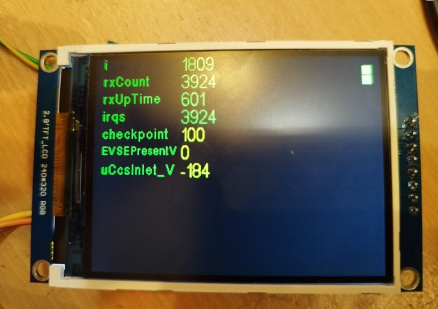
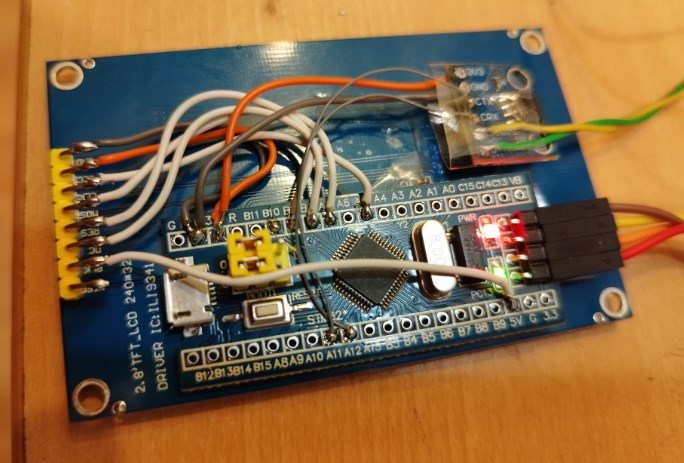
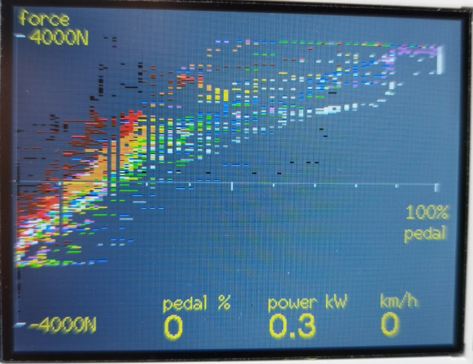

# TFT with CAN

STM32F1 "BluePill" receives data from CAN and shows it on a TFT display with ILI9341 via SPI

## Wiring

A12 CAN_TX
A11 CAN_RX
A5  DISPLAY_CLK
A7  DISPLAY_MOSI
B0  DISPLAY_DC
B1  DISPLAY_RES

The display works without CS and without MISO.
